# План интеграции электронных путевых листов (ЭПЛ)

Рабочий архитектурный план. Состояние источников проверено 13.08.2026 по актуальной
[документации API Контур.Логистики](https://developer.kontur.ru/doc/logistics.epl.api), двум
приложенным OpenAPI-файлам и
[XSD-схемам ФНС формата 5.01](https://www.nalog.gov.ru/html/sites/www.new.nalog.ru/docs/edo/116_170223format.zip).
Оба приложенных файла побайтно совпадают. Актуальная OpenAPI сохранила те же 25 путей и 205 схем;
на сайте расширено только общее описание авторизации.

## 1. Резюме решения

Для проекта подходит **гибридная интеграция**:

- портал формирует, подписывает и отправляет Т1 — титул диспетчера/владельца ТС;
- портал читает ленту событий и показывает весь ход ЭПЛ, в том числе титулы других участников;
- Т2 и Т6 формирует внешняя медицинская организация; медицинских данных, решений и форм в портале
  нет;
- Т3 оформляется вне портала ответственным за техническое состояние сотрудником, а портал только
  видит его результат. Канал оформления Т3 нужно утвердить до разработки: интерфейс
  Контур.Логистики или отдельная интеграция;
- Т4 и Т5 выносятся в отдельный опциональный модуль `epl-odometer`, включаемый флагом по
  организации. Если показания снимают вне сайта, портал только синхронизирует события;
- QR-код, PDF и полный архив документооборота портал получает из Контур.Логистики;
- существующий бумажный `waybill` остаётся внутренним основанием и снимком рейса. ЭПЛ — отдельный
  документооборот, связанный с ним, а не новый `form_code` и не ещё один статус бумажного листа.

Главное ограничение: Контур принимает не JSON с полями титула, а пару **XML + отсоединённая КЭП**
через `multipart/form-data`. API-ключ или OIDC авторизует HTTP-запрос, но не заменяет электронную
подпись документа. Значит, интеграция состоит из четырёх самостоятельных частей: подготовка
регламентного XML, КЭП, отправка и асинхронная синхронизация событий.

## 2. Граница ответственности по титулам

| Титул | Содержание                              | Кто оформляет                        | Роль портала                                                 |
| ----- | --------------------------------------- | ------------------------------------ | ------------------------------------------------------------ |
| Т1    | Обстоятельства и особенности рейса      | Диспетчер/представитель владельца ТС | Подготовка XML, проверка, КЭП, отправка                      |
| Т2    | Предрейсовый медосмотр                  | Внешняя медицинская организация      | Только ожидание и отображение события                        |
| Т3    | Предрейсовый техконтроль                | Ответственный сотрудник владельца ТС | В MVP только ожидание и отображение события                  |
| Т4    | Одометр при выезде                      | Ответственный за показания           | Опционально: ввод, КЭП, отправка; иначе только синхронизация |
| Т5    | Одометр при возвращении                 | Ответственный за показания           | Опционально: ввод, КЭП, отправка; иначе только синхронизация |
| Т6    | Послерейсовый медосмотр, если требуется | Внешняя медицинская организация      | Только ожидание и отображение события                        |

Внешней организацией, отличной от перевозчика, документация разрешает быть именно медицинской
организации. Поэтому «Т3 вне сайта» не означает передачу Т3 постороннему юрлицу: подписантом
остаётся уполномоченный сотрудник организации владельца ТС, просто работает он не в нашем портале.

Медицинская логика в сайт не попадает. Для Т1 всё же нужны два организационных реквизита:

- FNSId внешней медицинской организации;
- признак, обязателен ли послерейсовый медосмотр (`ОбМедОсмПосле`).

Это настройки документооборота, а не медицинские результаты.

## 3. Что даёт API и чего в нём нет

### Используемые возможности

| Возможность                    | Метод                                        | Назначение                                        |
| ------------------------------ | -------------------------------------------- | ------------------------------------------------- |
| Доступные организации          | `GET /v2/organizations/my`                   | Первичная проверка подключения                    |
| Реквизиты и FNSId по ИНН/КПП   | `GET /v1/organizations/requisites`           | Участники и имя файла титула                      |
| Отправка подписанного титула   | `POST /v1/epls/documents`                    | Два файла: XML и SIG; для Т1 возвращает `eplId`   |
| Лента событий                  | `GET /v1/epls/news/by-diadoc-box-id/{boxId}` | Основной входящий канал; до 100 событий за запрос |
| Поиск позиции ленты по времени | `.../find-eventId-by-timestamp`              | Начальная загрузка и восстановление курсора       |
| Текущее состояние ЭПЛ          | `GET /v2/epls/{id}`                          | Сверка состояния и восстановление после сбоев     |
| XML и подпись титула           | `GET /v1/epls/{id}/titles/{titleId}`         | Основание для формирования следующего титула      |
| QR-код                         | `GET /v1/epls/{eplId}/qr-code`               | Выдача водителю после принятия Т4                 |
| Печатная форма                 | `POST /v1/epls/{eplId}/print-form`           | PDF ЭПЛ                                           |
| Полный документооборот         | `POST /v1/epls/{eplId}/full-docflow`         | ZIP: XML, подписи и PDF                           |

Настройки полномочий водителей, показания топлива и заправки в текущий объём не входят.

Точки входа следует выбирать из жёсткого allowlist, а не хранить произвольным URL в БД:

- staging — `https://logist-api-staging.kontur.ru/`;
- production со стандартным TLS — `https://logist-api.kontur.ru/`;
- production с ГОСТ-шифрованием — `https://logist-api-gost.kontur.ru/`.

Если требуется ГОСТ-транспорт, его поддержку в контейнере/на VPS нужно проверить тем же spike,
что и КЭП: это отдельное требование к TLS-стеку, а не переключение строки URL.

### Ограничения, влияющие на архитектуру

- Webhook в OpenAPI нет: новые состояния нужно забирать polling-воркером.
- Метод отправки не объявляет ключ идемпотентности. После сетевого таймаута нельзя вслепую
  повторять `POST`: первый запрос мог быть принят. Сначала нужна сверка ленты/состояния.
- API не строит XML Т1 из DTO и не создаёт КЭП.
- Все титулы подписываются последовательно, кроме Т2 и Т3: они могут идти параллельно после Т1.
- Т4 возможен только после успешных Т2 и Т3; QR появляется после Т4.
- Для следующего титула нужны XML и подпись предыдущего титула. Их следует получать по `titleId`,
  а не собирать из отображаемого JSON.
- Исправление, аннулирование, замена водителя и отрицательный медосмотр нельзя автоматически
  приравнять к существующему бумажному `cancel/reissue`: для них нужен отдельный сценарий ЭПЛ.

## 4. Варианты глубины интеграции

### Вариант A. Только переход в Контур

Портал показывает ссылку/инструкцию, а весь ЭПЛ оформляется в Контуре. Почти нет разработки, но
двойной ввод остаётся, статуса в рейсе нет, QR и ошибки ищут в другой системе.

Подходит только как временный запуск.

### Вариант B. Т1 + синхронизация — рекомендуемый MVP

Портал готовит Т1 из существующего рейса, получает КЭП диспетчера, отправляет документ и ведёт его
статус. Т2, Т3, Т4, Т5 и Т6 в MVP создаются вне сайта. QR, PDF и архив доступны из карточки рейса.

Это даёт основную экономию двойного ввода и не затягивает в проект медицинские и гаражные процессы.

### Вариант C. Т1 + Т4/Т5

Поверх MVP портал снимает предрейсовое и послерейсовое показания, формирует Т4/Т5 и подписывает их
КЭП ответственного лица. Модуль включается отдельно и не меняет Т1.

### Вариант D. Все титулы

Т2, Т3 и Т6 тоже оформляются в портале. Текущей постановке противоречит и не рекомендуется: требует
медицинских, технических, лицензионных и подписных процессов, которых в проекте сейчас нет.

## 5. Целевая архитектура

```mermaid
flowchart LR
  UI[Карточка рейса / журнал ЭПЛ] --> CMD[Команды ЭПЛ]
  CMD --> SNAP[Неизменяемый снимок Т1]
  SNAP --> XML[Генератор XML 5.01]
  XML --> SIGN[Контур КЭП]
  SIGN --> OUTBOX[Outbox jobs]
  OUTBOX --> ADAPTER[KonturEplProvider]
  ADAPTER --> K[Контур.Логистика / Диадок / ГИС ЭПД]
  K --> POLL[Polling ленты]
  POLL --> INBOX[Inbox событий + cursor]
  INBOX --> PROCESS[Процесс-менеджер ЭПЛ]
  PROCESS --> UI
  PROCESS --> ODO[Опциональные Т4/Т5]
```



### 5.1. Антикоррупционный слой провайдера

Вся специфика Контур живёт за интерфейсом `EplProvider`. Бизнес-код не должен знать URL, имена
`eventType`, multipart-поля и модели `KL.Public.Client.*`.

Предлагаемые методы адаптера:

```ts
interface EplProvider {
  getOrganizations(): Promise<ProviderOrganization[]>;
  getRequisites(input: { inn: string; kpp?: string }): Promise<ProviderRequisites>;
  reserveUid(input: { boxId: string }): Promise<string>;
  sendTitle(input: SignedTitle): Promise<{ eplId: string }>;
  readEvents(input: EventCursor): Promise<EventBatch>;
  findCursorByTime(input: { boxId: string; at: string }): Promise<string | null>;
  getEpl(eplId: string): Promise<ProviderEpl>;
  getTitleArchive(eplId: string, titleId: string): Promise<Uint8Array>;
  getQr(eplId: string): Promise<Uint8Array>;
  getPrintForm(eplId: string): Promise<Uint8Array>;
  getFullDocflow(eplId: string): Promise<Uint8Array>;
}
```

Начать можно с одного `KonturEplProvider`; интерфейс нужен не ради гипотетической смены оператора,
а чтобы доменная модель, тесты и обработка ошибок не зависели от сгенерированных имён OpenAPI.

### 5.2. Модули проекта

| Модуль           | Предлагаемое место                        | Ответственность                                               |
| ---------------- | ----------------------------------------- | ------------------------------------------------------------- |
| Контракты ЭПЛ    | `packages/contracts/src/epl.ts`           | Команды, DTO, состояния, права, feature flags                 |
| Доменный процесс | `apps/api/src/services/epl/process.ts`    | Допустимые переходы и готовность титулов                      |
| Снимок Т1        | `apps/api/src/services/epl/snapshot.ts`   | Сбор и заморозка данных рейса                                 |
| XML              | `apps/api/src/services/epl/xml/*`         | T1, позднее T4/T5; формат 5.01; детерминированный вывод       |
| XSD-валидация    | `apps/api/src/services/epl/validation.ts` | Проверка до подписи и сохранение отчёта                       |
| Подпись          | `apps/api/src/services/epl/signing/*`     | Подготовка байтов, запрос подписи, проверка сертификата/SIG   |
| Контур-адаптер   | `apps/api/src/integrations/kontur-epl/*`  | HTTP, auth, multipart, таймауты, классификация ошибок         |
| Входящие события | `apps/api/src/services/epl/events.ts`     | Inbox, cursor, дедупликация, проекция состояния               |
| Фоновые задачи   | `apps/worker/src/jobs/epl-*`              | Отправка, polling, сверка, получение QR/архива                |
| HTTP API портала | `apps/api/src/routes/epl.ts`              | Подготовить, подписать, отправить, читать состояние/артефакты |
| Интерфейс        | `apps/web/src/pages/waybills/epl/*`       | Панель ЭПЛ, готовность, подпись, timeline, QR, ошибки         |
| Одометр          | `.../services/epl/odometer.ts`            | Изолированные черновики Т4/Т5 и связь с показаниями парка     |

### 5.3. Основные паттерны

1. **Неизменяемый снимок.** Т1 строится из отдельного JSON-снимка. Изменения водителя, машины,
   адреса или организации после подписи не переписывают документ.
2. **State machine + process manager.** Состояние выводится из собственных команд и событий
   Контур, а не из одного изменяемого поля, которое можно перескочить вручную.
3. **Transactional outbox.** Запись намерения отправить титул и job появляются в одной транзакции.
4. **Inbox + durable cursor.** Событие сначала сохраняется по `eventId`, затем применяется; курсор
   двигается в той же транзакции. Повтор страницы безопасен.
5. **At-least-once для чтения, осторожный once для отправки.** Polling и обработка событий
   идемпотентны. Неопределённый исход `POST` переводится в `send_unknown`, а не в автоматический
   повтор.
6. **Явная граница подписи.** После подписания байты XML неизменяемы: нельзя менять кодировку,
   переводы строк, пробелы или имя файла.
7. **Feature flag по организации.** `off | test | production` для ЭПЛ и `external | portal` для
   одометра. Тестовые и рабочие документы физически разделены окружением и признаком `isTest`.
8. **Fail closed.** То, что допустимо оставить пустым в бумажном бланке, может быть блокером ЭПЛ.
   XML не отправляется при неполном обязательном комплекте.

## 6. Модель данных

ЭПЛ не следует встраивать колонками `epl_*` в `waybills`: поток содержит несколько титулов,
асинхронные события, попытки отправки и внешние идентификаторы.

### `epl_organization_connections`

- `organization_id`;
- `provider = 'kontur'`;
- `environment = 'staging' | 'production'`;
- `diadoc_box_id`, `fns_participant_id`;
- FNSId медицинской организации;
- политика послерейсового медосмотра;
- режим ЭПЛ и режим одометра;
- ссылка на секрет API (`secret_ref`), но не сам API-key в БД;
- состояние проверки подключения и время последней успешной проверки.

Отдельная строка на организацию и окружение нужна уже сейчас: в проекте несколько
`organizations`, а машина выбирает владельца.

### `epl_instances`

- связь с `waybills.id`;
- внешний `epl_id`, `mintrans_id/uid`, `previous_uid`;
- `provider`, `environment`, `is_test`;
- версия формата, номер и период документа;
- агрегированное состояние (`draft`, `awaiting_t1_signature`, `sending_t1`, `waiting_external`,
  `ready_for_t4`, `on_route`, `ready_for_t5`, `waiting_t6`, `closed`, `invalid`, `manual_review`);
- снимок readiness и версия строки;
- причина ошибки, время последней сверки.

Нужна частичная уникальность: не больше одного незавершённого ЭПЛ на один действующий внутренний
лист, но история не удаляется.

### `epl_titles`

- `epl_instance_id`, тип `T1..T6`, направление `outgoing | incoming`;
- состояние `draft | awaiting_signature | signed | queued | sending | sent | send_unknown |
accepted | rejected`;
- внешний `title_id/document_id`;
- `file_id`, имя XML, версия формата;
- SHA-256 точных XML-байтов и SIG;
- object key XML/SIG в S3;
- метаданные сертификата: thumbprint, serial, subject, срок действия;
- подписант, время подписи/отправки/принятия;
- структурированная ошибка провайдера и `traceId` без секретов.

XML и SIG — юридически значимые артефакты. Их хранилище должно быть неизменяемым для приложения;
скачивание — только по праву ЭПЛ и через аудит.

### `epl_operations`

Журнал команд `prepare_t1`, `request_signature`, `send_title`, `reconcile`, `download_archive`:

- клиентский `operation_id` и уникальный бизнес-отпечаток;
- актёр, команда, входной hash;
- результат, ошибка, начало и окончание.

Он защищает кнопки от двойного нажатия и объясняет неопределённый результат отправки.

### `epl_events` и `epl_event_cursors`

- событие уникально по `(connection_id, event_id)`;
- сохраняются тип, UTC-время, `eplId`, `documentId`, payload hash и только разрешённые
  нормализованные детали;
- по медицинским событиям сохраняется минимальный итог, нужный процессу: ожидается, завершён
  успешно или отказ. ФИО медработника, лицензии и прочий исходный payload в доменную БД не
  копируются;
- неизвестный `eventType` сохраняется и поднимает предупреждение, но не ломает polling. Если для
  разбора нужен исходный JSON, он попадает в отдельный зашифрованный quarantine с коротким сроком
  хранения и ограниченным доступом, а не в обычный журнал;
- cursor хранится отдельно по ящику Диадока;
- событие и новый cursor фиксируются атомарно.

### `epl_odometer_drafts` — только при включении Т4/Т5

- `epl_instance_id`, `phase = pre_trip | post_trip`;
- значение в километрах, локальное время и UTC offset;
- ответственное лицо;
- источник `manual | vehicle_reading` и опциональный `vehicle_reading_id`;
- зафиксированный снимок и состояние подписи.

Текущий `vehicle_readings.odometer_km` — показание по строке отчёта смены, обычно на конец смены.
Оно не равно автоматически Т4 или Т5: у ЭПЛ важны фаза рейса, точное время, ответственное лицо и
КЭП. Значение можно **предложить** в черновик Т5, но перед отправкой требуется явное подтверждение.
Т4 текущая модель показаний вообще не покрывает.

## 7. Данные Т1: что уже есть и что нужно добавить

| Блок           | Уже есть                                                    | Пробел перед ЭПЛ                                            |
| -------------- | ----------------------------------------------------------- | ----------------------------------------------------------- |
| Организация    | Наименование, адрес, телефон, ИНН, ОГРН, ОКПО               | КПП, FNSId, Diadoc box, нормализованные контакты            |
| Медорганизация | Нет профильной связи                                        | ИНН/КПП, FNSId, box id, правило Т6                          |
| ТС             | Тип проекта, модель, изготовитель, гос/инв. номер, владелец | Точное «тип/марка/модель по ПТС» отдельными полями          |
| Прицеп         | На рейсе есть модель и госномер                             | XSD требует и марку, и модель; нужны структурированные поля |
| Водитель       | ФИО по частям, удостоверение: серия, номер, дата            | Для ЭПЛ неполный документ должен стать жёстким блокером     |
| Рейс           | Дата, водитель, ТС, заявки, адреса, назначение              | Структурированные коды вида перевозки и сообщения, срок ПЛ  |
| Т1             | Номер внутреннего листа и снимок                            | `ОбМедОсмПосле`, признак начала рейса, предыдущий UID       |
| Подписант      | Пользователь и аудит выдачи бумаги                          | Должность, способ полномочий, МЧД/доверенность, сертификат  |

Нельзя переиспользовать свободные строки `communication_kind` и `transportation_kind` как коды
XML. Для ЭПЛ нужны перечисления формата 5.01:

- вид перевозки: коммерческая / собственные нужды / специальное ТС;
- при коммерческой перевозке — её вид;
- вид сообщения: городской / пригородный / междугородный.

Маппинг должен быть явным и покрытым тестами. Для маршрута `freight`, перегона
`delivery/pickup`, легкового листа и недельного ЭСМ-2 правила могут различаться; сначала в rollout
следует включить один подтверждённый бизнес-сценарий, а не угадывать общий код по виду бланка.

## 8. Подпись

API Контур не предоставляет в этой спецификации операцию подписи. Выбор контура КЭП — блокирующее
архитектурное решение.

### Рекомендуемый старт: локальная КЭП диспетчера

1. Backend формирует и XSD-валидирует точные XML-байты.
2. Frontend получает одноразовый запрос подписи с hash и сроком жизни.
3. Локальный КриптоПро-провайдер подписывает эти байты сертификатом пользователя.
4. Backend проверяет, что подпись относится к ожидаемому hash и допустимому сертификату.
5. XML и SIG архивируются, затем outbox отправляет их в Контур.

Плюсы: закрытый ключ не попадает на сервер, акт подписания остаётся у конкретного сотрудника.
Минусы: зависимость от ОС, браузера, КриптоПро и рабочего места. Это обязательно проверяется
коротким прототипом до основной разработки.

### Альтернатива: серверная КЭП/HSM/КриптоПро DSS

Удобнее для автоматизации Т4/Т5, но требует отдельного решения по хранению ключа, лицензиям,
полномочиям, подтверждению каждого подписания и отказоустойчивости. Нельзя начинать с хранения
контейнера закрытого ключа рядом с приложением или API-key.

### Инварианты подписи

- API-key/OIDC и КЭП — разные механизмы;
- приватный ключ никогда не передаётся в портал;
- XML валидируется **до** подписи;
- после подписи сравнивается SHA-256 и запрещается любая сериализация XML;
- проверяются срок сертификата, цепочка доверия, отозванность и полномочия/МЧД;
- подпись, сертификат, актёр и исходный XML входят в аудит.

## 9. Рабочие процессы

### 9.1. Подключение организации

1. Получить у менеджера Контур доступ к staging и production и завести приложение в кабинете
   интегратора.
2. Для server-to-server запросов выбрать API-key и хранить его в secret storage/host env. OIDC
   оставлять только если Контур требует делегировать HTTP-действие конкретному пользователю.
3. Проверить организацию через `GET /v2/organizations/my` и реквизиты через
   `GET /v1/organizations/requisites`.
4. Сопоставить `organizations.id` с Diadoc box и FNSId.
5. Завести внешнюю медицинскую организацию и проверить, что она подключена к Логистике.
6. Настроить подписантов Т1, а при необходимости Т4/Т5, сертификаты и полномочия.
7. Пройти тестовый документооборот в staging до QR и закрытия.

### 9.2. Подготовка и отправка Т1

1. Диспетчер выпускает существующий внутренний путевой лист по рейсу.
2. В карточке появляется отдельное действие «Оформить ЭПЛ», если организация включена и этот тип
   рейса входит в rollout.
3. Readiness-проверка перечисляет ошибки по блокам: организация, медорганизация, ТС, прицепы,
   водитель, рейс, подписант. В отличие от бумажного листа обязательные реквизиты нельзя пропустить
   с предупреждением.
4. Backend в одной транзакции создаёт `epl_instance`, снимок Т1 и `epl_title(T1, draft)`.
5. Генератор создаёт XML в кодировке и формате XSD 5.01 и валидирует XSD + бизнес-правила.
6. Диспетчер подписывает точные байты.
7. Backend проверяет SIG, сохраняет XML/SIG и создаёт outbox-job.
8. Worker отправляет оба файла в `POST /v1/epls/documents`.
9. При `200` сохраняется `eplId`; состояние переходит в ожидание внешних Т2/Т3.
10. При таймауте состояние — `send_unknown`; worker сначала сверяет ленту и текущие ЭПЛ, и только
    после доказанного отсутствия документа разрешает ручной повтор.

Оформление ЭПЛ не стоит делать неотменяемым side effect кнопки «Выписать бумажный лист»: между
сборкой данных и юридической подписью есть пользовательский шаг, который может не состояться.

### 9.3. Внешние Т2 и Т3

1. Poller читает ленту по Diadoc box, сохраняя страницы и cursor.
2. События `DriverCheckupsCreated/Passed` и `VehicleTechInspection*` обновляют проекцию ЭПЛ.
3. Портал показывает только нейтральные состояния: «ожидается внешний медосмотр», «медосмотр
   завершён», «ожидается техконтроль», «выпуск разрешён/не разрешён».
4. Форм, диагнозов, лицензий врача и действий «допустить» в портале нет.
5. Отрицательный Т2 или запрещающий Т3 переводит ЭПЛ в отдельное терминальное/ручное состояние;
   существующий рейс не должен автоматически продолжать бумажный workflow.

### 9.4. Т4/Т5 вне портала

MVP только принимает события `VehicleOdometerReading*`, `VehicleDeparted`, `VehicleArrived` и
`QRCodeReceived`. В карточке видны значения/время, если их вернул провайдер, но изменить или
подписать их нельзя.

### 9.5. Т4/Т5 через портал

1. Т4 разрешается только после успешных Т2 для всех водителей и успешного Т3.
2. Backend получает архив Т3, извлекает XML и SIG и проверяет их hash.
3. Ответственный вводит предрейсовое значение и точное локальное время с UTC offset.
4. Создаётся, валидируется и подписывается Т4; отправка идёт тем же outbox-протоколом.
5. После `VehicleDeparted/QRCodeReceived` портал получает QR и делает его доступным водителю.
6. После возвращения создаётся Т5 на основе Т4. Значение из `vehicle_readings` можно подставить
   только как предложение с указанием источника.
7. После Т5 поток закрывается либо ждёт внешний Т6 согласно признаку из Т1.

### 9.6. Синхронизация и сверка

- активные ящики опрашиваются часто; закрытые ЭПЛ не требуют частого polling;
- страницы читаются до опустошения `nextEventId`, не только по одной за запуск;
- события могут повториться и прийти после локального результата отправки;
- неизвестное событие не останавливает cursor;
- периодический reconciler сравнивает незавершённые агрегаты с `GET /v2/epls/{id}`;
- при потере cursor используется `find-eventId-by-timestamp`, затем события переигрываются через
  тот же inbox;
- QR/PDF/ZIP кешируются как артефакты с контрольной суммой, а не генерируются на каждый просмотр.

## 10. Изменения интерфейса и прав

### Карточка рейса/путевого листа

- блок «ЭПЛ»: номер, среда `Тест/Рабочая`, общий статус и время последней синхронизации;
- readiness со ссылками на конкретные карточки, где не хватает реквизитов;
- действие «Подготовить Т1», затем отдельное «Подписать и отправить»;
- timeline Т1–Т6, где внешние титулы только для чтения;
- QR, PDF и архив после появления;
- явное состояние `Неизвестен результат отправки — идёт сверка`, без кнопки мгновенного повтора;
- техническая ошибка показывается оператору понятным текстом, `traceId` — в деталях для поддержки.

### Настройки организации

- окружение, box id, FNSId, медицинская организация;
- политика Т6;
- режим `off/test/production`;
- режим одометра `external/portal`;
- проверка подключения без вывода API-key;
- список допустимых подписантов и статус их сертификатов.

### Права

Рекомендуемый минимальный набор:

- `epl.read` — видеть статусы и артефакты;
- `epl.prepareT1` — формировать снимок и XML;
- `epl.signT1` — подписывать и отправлять Т1;
- `epl.odometer.write` — создавать Т4/Т5;
- `epl.odometer.sign` — подписывать Т4/Т5;
- `epl.admin` — подключения, FNSId, режимы и ручная сверка;
- `epl.archive.download` — скачивать юридически значимый архив.

Права должны проверяться API независимо от скрытия кнопок в React. Действие подписи дополнительно
ограничивается сертификатом и полномочиями, одной роли портала недостаточно.

## 11. Ошибки, аудит и наблюдаемость

### Классификация ошибок

- `400/404` на отправке — бизнес/форматная ошибка, автоматический retry запрещён;
- `401/403` — ошибка подключения или полномочий, блокируются новые отправки организации;
- `429/5xx/network` до получения ответа — неопределённый исход, сначала reconciliation;
- `Invalid` или отказ ГИС — ручной разбор с исходным XML, SIG, событием и trace id;
- ошибка XSD — ошибка подготовки, до подписи и внешнего вызова;
- истёкший/отозванный сертификат — ошибка подписи, не ошибка Контур.

### Аудит

Записывать: кто создал снимок, кто подписал, hash XML/SIG, сертификат, кто запустил отправку,
результат HTTP без секретов, все входящие события, ручные повторы и скачивание архива. Медицинские
данные сверх минимального результата, необходимого для продолжения ЭПЛ, в собственный аудит не
копировать.

### Метрики и алерты

- возраст последнего успешного polling по ящику;
- lag между `timestampUtc` события и обработкой;
- ЭПЛ в `send_unknown`, `invalid`, `manual_review`;
- очередь jobs и dead jobs по типу ЭПЛ;
- время от Т1 до Т2, Т3, Т4 и QR;
- ошибки 401/403 и срок действия сертификатов;
- количество неизвестных `eventType`.

## 12. Этапы реализации

### Этап 0. Интеграционный spike — обязательный до основной разработки

- получить staging-доступ, API-key и тестовые организации;
- согласовать, кто и где оформляет Т3;
- выбрать локальную или серверную КЭП и подписать тестовый XML;
- получить FNSId всех участников;
- проверить фактический multipart-запрос и полный тестовый поток до QR;
- выяснить у Контур стратегию UID. Текущая страница Т1 предлагает получать UID, XSD делает его
  опциональным, поэтому это должно быть решением провайдера, а не догадкой в коде;
- согласовать сценарии исправления/аннулирования и смены водителя;
- утвердить, какие рейсы входят в первую волну.

**Результат:** подписанный тестовый Т1, таблица маппинга, выбранный контур КЭП и закрытые вопросы,
без которых production-код пришлось бы переделывать.

### Этап 1. Основа и read-only синхронизация

- миграции connections/instances/titles/events/cursors/operations;
- provider adapter и секреты;
- polling, inbox, cursor, `GET /v2/epls/{id}` и timeline;
- настройки организации и права;
- метрики, аудит и ручная сверка.

**Результат:** портал надёжно видит тестовые ЭПЛ, созданные вне него.

### Этап 2. MVP Т1

- readiness и заполнение пробелов справочников;
- снимок и явный маппинг одного согласованного вида рейса;
- генератор T1 5.01 и XSD-валидация;
- контур КЭП;
- outbox-отправка с `send_unknown` и reconciliation;
- QR, PDF и архив в карточке.

**Результат:** диспетчер оформляет Т1 в портале, внешние Т2/Т3 проходят без логики сайта, а портал
показывает процесс до закрытия.

### Этап 3. Production hardening и rollout

- sandbox E2E для положительных и отрицательных веток;
- нагрузочный тест polling нескольких ящиков;
- runbook: 401/403, cursor, dead job, unknown send, `Invalid`, истечение сертификата;
- пилот на одной организации, одном типе рейса и ограниченной группе диспетчеров;
- только после стабильного пилота — остальные организации и виды рейсов.

### Этап 4. Опциональные Т4/Т5

- отдельный backlog после решения, что одометр действительно снимается через сайт;
- `epl_odometer_drafts`, формы pre/post, КЭП ответственного;
- получение предыдущего титула, T4/T5 XML, события и QR;
- адаптер к `vehicle_readings` без автоматической юридической отправки показания смены.

## 13. Проверки

### Unit

- маппинг каждого поля и перечисления Т1;
- детерминированность XML: одинаковый снимок даёт одинаковые байты;
- XSD-валидация положительных и отрицательных fixtures;
- filename/`ИдФайл`, FNSId, даты и часовой пояс;
- state machine, в том числе дубликаты и неожиданный порядок событий;
- readiness по организации, ТС, водителю, прицепу и подписанту.

### Интеграционные

- транзакция outbox и восстановление job;
- inbox + cursor при повторе одной страницы;
- таймаут после фактически принятого `POST`;
- 400/401/403/404/429/5xx и неизвестный event type;
- конкурентное двойное нажатие «Отправить»;
- доступ к XML/SIG/архиву по правам;
- связь с аннулированным/скорректированным внутренним листом.

### Staging E2E

- Т1 → внешний успешный Т2 → успешный Т3 → внешний Т4 → QR → Т5 → закрытие;
- обязательный Т6 и завершение внешним медиком;
- отрицательный Т2;
- запрещающий Т3;
- два водителя;
- Т4/T5 через портал, если модуль включён;
- сбой сети при отправке и последующая сверка без дубля.

## 14. Решения, которые нужны до production

1. Кто подписывает Т1 и какой контур КЭП используется?
2. Кто оформляет Т3 и в каком интерфейсе?
3. Какая медицинская организация участвует у каждого юрлица и когда обязателен Т6?
4. ЭПЛ заменяет бумажный лист или на переходный период они сосуществуют? Это нельзя молча решить
   техническим feature flag.
5. С какого сценария начинать: 4-П грузоперевозка, форма № 3, перегон или ЭСМ-2?
6. Какой набор организаций и Diadoc boxes включается в первую волну?
7. UID резервируется заранее или назначается оператором при отправке?
8. Как юридически обрабатываются отмена рейса, исправление, перевыписка и смена водителя после Т1?
9. Одометр остаётся в Контуре или вводится в портале; кто подписывает Т4/Т5?
10. Какой срок хранения XML, SIG, PDF, ZIP и событий утверждён ответственными за ЭДО и ПДн?

До ответов на пункты 1–4 и 7–8 безопасно реализовывать read-only синхронизацию и provider adapter,
но не production-отправку Т1.
